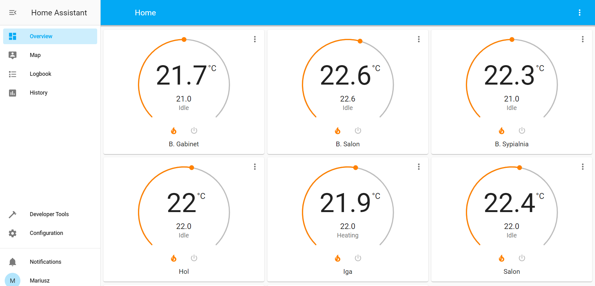
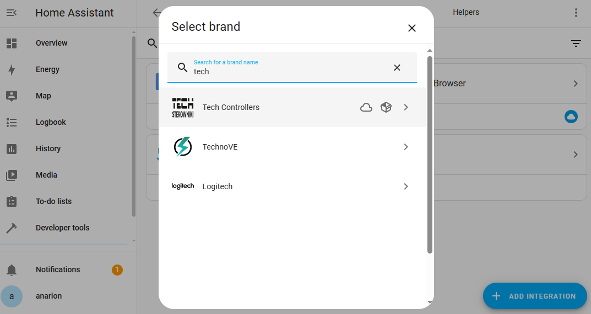
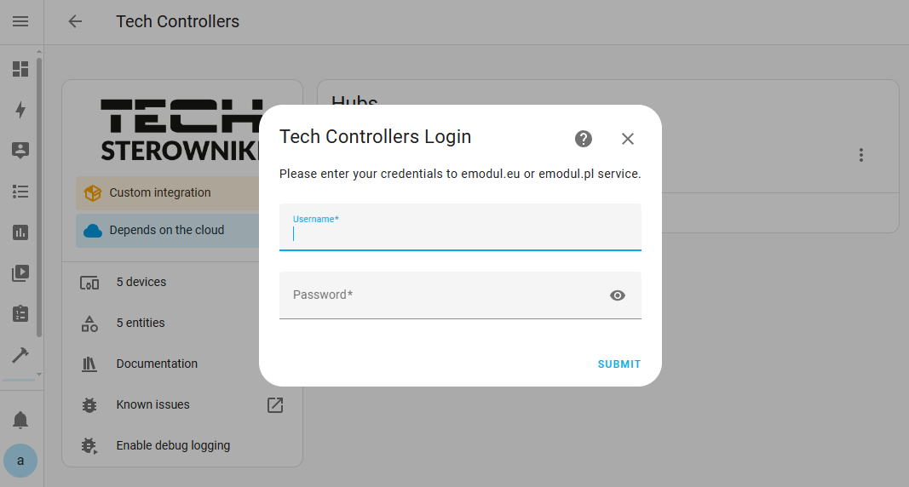
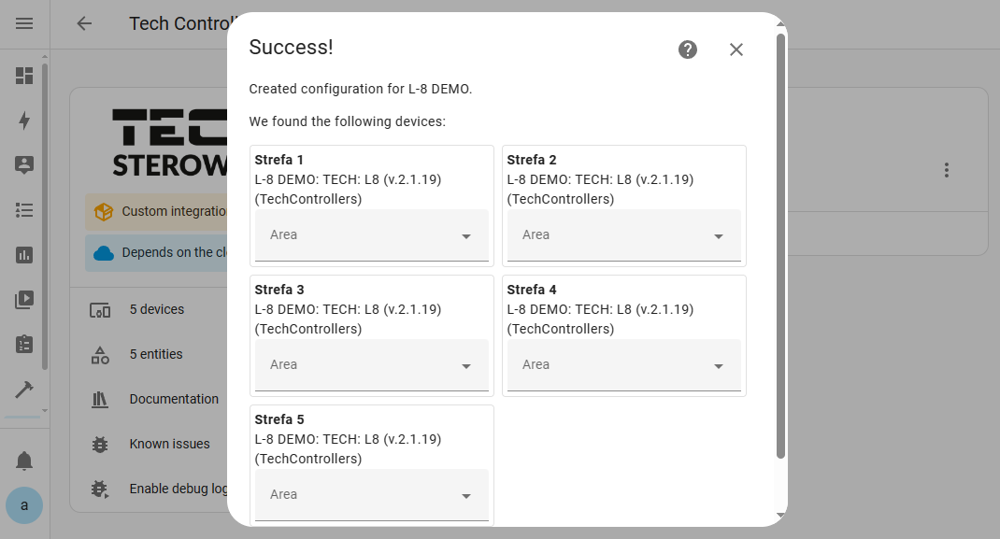
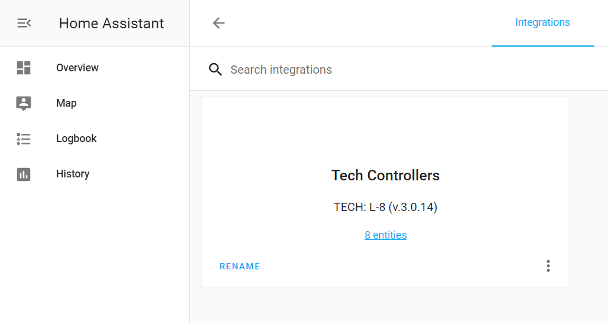

# :jigsaw: TECH Controllers integration for Home Assistant

[![GitHub Release][releases-shield]][releases]
[![GitHub Activity][commits-shield]][commits]
[![License][license-shield]](LICENSE)

[![Project Maintenance][maintenance-shield]][maintainer]

This is an integration of heating controllers from Polish company TECH Sterowniki Sp. z o.o. It uses [API](https://api-documentation.emodul.eu/) to their web control application eModul.eu, therefore your controller needs to be accessible from the Internet and you need an account either on <https://emodul.eu> or <https://emodul.pl>.

The integration is based on API provided by TECH which supports the following controllers:

- L-4 Wifi
- L-7
- L-8
- WiFi 8S
- ST-8S WiFi
- M-9r
- L-X WiFi
- L-12

The integration was developed and tested against eModul demo account (username: `test`/password: `test`) which features 4 controllers:

- I-3
- L-8
- Pellet
- Solar

> [!WARNING]
> Everything else might or might not work - needs community help, testing and reporting back what works. Check below for reported working controllers.

## :sparkles: Features

- Configuration through UI
- Support for multiple controllers which can be individually imported under given single account
- Provides Climate entities representing zones
  - and their corresponding Temperature, Battery, Humidity sensors when available
- Climate entities display data through Thermostat card
- Provides sensors for eModul 'tiles'
- Automatic naming and translations of tiles from eModul API

**This integration will set up the following platforms.**

Platform | Description
-- | --
`binary_sensor` | Show info and status from Tech API.
`sensor` | Show info and status from Tech API.
`climate` | Thermostats.

## :pencil2: Plans for development

- [ ] Publish the tech.py Python Package to PyPI
- [ ] Write proper test suite for the integration
- [ ] Support for window opening sensor
- [ ] Support for cold tolerance setting
- [ ] Support for zones schedules
- [ ] Services for pumps, operating mode changes, etc

## :building_construction: Installation

### HACS

### Manual

1. Using the tool of choice open the directory (folder) for your HA configuration (where you find `configuration.yaml`).
1. If you do not have a `custom_components` directory (folder) there, you need to create it.
1. In the `custom_components` directory (folder) create a new folder called `tech`.
1. Download _all_ the files from the `custom_components/tech/` directory (folder) in this repository.
1. Place the files you downloaded in the new directory (folder) you created.
1. Restart Home Assistant
1. In the HA UI go to "Configuration" -> "Integrations" click "+" and search for "Tech Controllers"
1. Enter your username (could be email) and password for your eModule account and click "Submit" button.
1. In the next step select the controllers you want to import/integrate
1. You should see "Success!" dialog with the name of the imported controller(s).
1. Now you should have Climate entities representing your home zones available in Home Assistant. Go to your UI Lovelace configuration and add Thermostat card with your Climate entities.

## :arrow_up: Migration to version 2

Integration supports migration from [version 1](https://github.com/mariusz-ostoja-swierczynski/tech-controllers/releases/tag/v1.0.0). Migration creates new devices, links appropriate entities to them, and removes entities that are no longer provided by the integration.

> [!CAUTION]
> :warning: This is tested only on one controller (M-9r) so please be aware there might be issues :warning: In case of problems, delete the integration and its entities, restart Home Assistant and add/configure the integration again.

## :rocket: List of reported working TECH Controllers

- L4-WiFi (v.1.0.24)
- L-7 (v.2.0.8)
- L-7E (v.1.0.6)
- L-8 (v.3.0.14)
- L-9r (v1.0.2)
- WiFi 8S (v.2.1.8)
- ST-8s WIFI (v.1.0.5)
- ST-16s WIFI (v.1.0.5)
- M-9 (v1.0.12)
- M-9r (v1.3.8)
- L-X WiFi (v1.0.6)
- L-12 (v.1.0.16)

## :pray: Thanks

Version 2 of the integration is based on work from several contributors and/or forks of the original integration:

- [MichalKrasowski](https://github.com/MichalKrasowski)
- [micles123](https://github.com/micles123)
- [nedyarrd](https://github.com/nedyarrd)
- [anarion80](https://github.com/anarion80)
- others

## :warning: Disclaimer

The integration is in no way supported or endorsed by TECH Sterowniki sp. z o.o.

## 📝 Copyright & License

Copyright (c) 2024, Released under the [MIT](LICENSE) license.

***

[commits-shield]: https://img.shields.io/github/commit-activity/y/custom-components/blueprint.svg?style=for-the-badge
[commits]: https://github.com/mariusz-ostoja-swierczynski/tech-controllers/commits/main
[license-shield]: https://img.shields.io/github/license/mariusz-ostoja-swierczynski/tech-controllers?style=for-the-badge
[maintenance-shield]: https://img.shields.io/badge/current%20maintainer-anarion80-blue.svg?style=for-the-badge
[maintainer]: https://github.com/anarion80
[releases-shield]: https://img.shields.io/github/release/mariusz-ostoja-swierczynski/tech-controllers.svg?style=for-the-badge
[releases]: https://github.com/mariusz-ostoja-swierczynski/tech-controllers/releases
