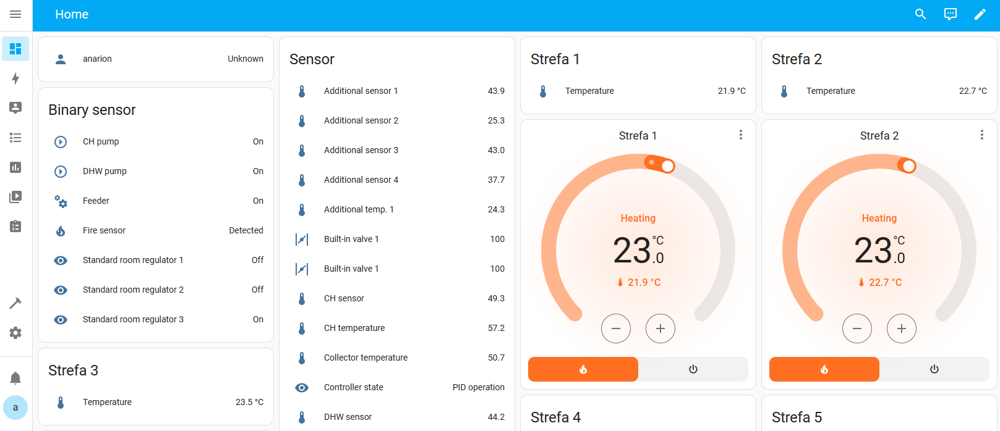
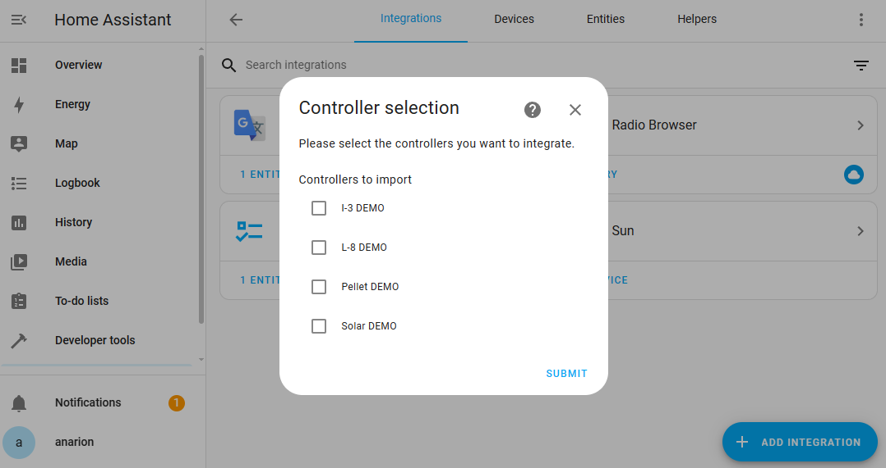
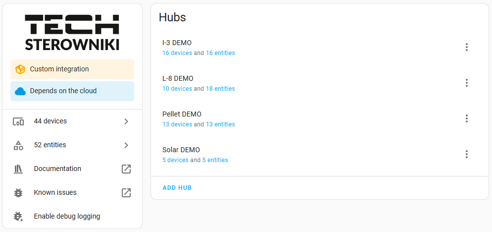

# :jigsaw: TECH Controllers integration for Home Assistant

[![GitHub Release][releases-shield]][releases]
[![GitHub Activity][commits-shield]][commits]
[![License][license-shield]](LICENSE)

[![Project Maintenance][maintenance-shield]][maintainer]

This is an integration of heating controllers from Polish company TECH Sterowniki Sp. z o.o. It uses [API](https://api-documentation.emodul.eu/) to their web control application eModul.eu, therefore your controller needs to be accessible from the Internet and you need an account either on <https://emodul.eu> or <https://emodul.pl>.

The integration is based on API provided by TECH which supports the [list of compatible controllers](https://github.com/mariusz-ostoja-swierczynski/tech-controllers?tab=readme-ov-file#rocket-list-of-reported-working-tech-controllers)

The integration was developed and tested against eModul demo account (username: `test`/password: `test`) which features 4 controllers:

- I-3
- L-8
- Pellet
- Solar

and community reported controllers.

> [!WARNING]
> Everything else might or might not work - needs community help, testing and reporting back what works. Check below for reported working controllers.

## :sparkles: Features

- Configuration through UI
- Support for multiple controllers which can be individually imported under given single account
- Provides Climate entities representing zones
  - and their corresponding Temperature, Battery, Humidity sensors, Window sensors when available
- Climate entities display data through Thermostat card
- Provides sensors for eModul 'tiles'
- Automatic naming and translations of tiles from eModul API
- Supporting languages which are supported by eModul API

**This integration will set up the following platforms.**

Platform | Description
-- | --
`binary_sensor` | Show info and status from Tech API.
`sensor` | Show info and status from Tech API.
`climate` | Thermostats.

## :building_construction: Installation

### HACS

### Manual

1. Using the tool of choice open the directory (folder) for your HA configuration (where you find `configuration.yaml`).
1. Download `tech.zip` asset from [latest release](https://github.com/mariusz-ostoja-swierczynski/tech-controllers/releases/latest)
1. Unzip into `custom_components/` directory (folder), if directory doesnt exist, create it.
1. Restart Home Assistant
1. In the HA UI go to `Configuration` -> `Integrations` click `+` and search for `Tech Controllers`

1. Enter your username (could be email) and password for your eModule account and click "Submit" button.

1. In the next step select the controllers you want to import/integrate

1. You should see "Success!" dialog with the name of the imported controller(s).

1. Now you should have controllers and entities representing your home zones available in Home Assistant. Go to your UI Lovelace configuration and add Thermostat card with your Climate entities.

## :rocket: List of reported working TECH Controllers

- L-7 (v.2.0.8)
- L-7E (v.1.0.6)
- L-8 (v.3.0.14)
- L-9r (v1.0.2)
- L-12 (v.1.0.16)
- L4-WiFi (v.1.0.24)
- L-X WiFi (v1.0.6)
- M-9 (v1.0.12)
- M-9r (v1.3.8)
- ST-8s WIFI (v.1.0.5)
- ST-16s WIFI (v.1.0.5)
- WiFi 8S (v.2.1.8)

## :pray: Thanks

Version 2 of the integration is based on work from several contributors and/or forks of the original integration:

- [MichalKrasowski](https://github.com/MichalKrasowski)
- [micles123](https://github.com/micles123)
- [nedyarrd](https://github.com/nedyarrd)
- [anarion80](https://github.com/anarion80)
- others

## :warning: Disclaimer

The integration is in no way supported or endorsed by TECH Sterowniki sp. z o.o.

## 📝 Copyright & License

Copyright (c) 2024, Released under the [MIT](LICENSE) license.

***

[commits-shield]: https://img.shields.io/github/commit-activity/y/custom-components/blueprint.svg?style=for-the-badge
[commits]: https://github.com/mariusz-ostoja-swierczynski/tech-controllers/commits/main
[license-shield]: https://img.shields.io/github/license/mariusz-ostoja-swierczynski/tech-controllers?style=for-the-badge
[maintenance-shield]: https://img.shields.io/badge/current%20maintainer-anarion80-blue.svg?style=for-the-badge
[maintainer]: https://github.com/anarion80
[releases-shield]: https://img.shields.io/github/release/mariusz-ostoja-swierczynski/tech-controllers.svg?style=for-the-badge
[releases]: https://github.com/mariusz-ostoja-swierczynski/tech-controllers/releases
