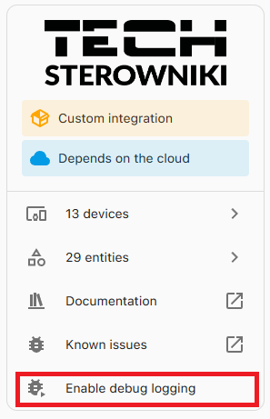
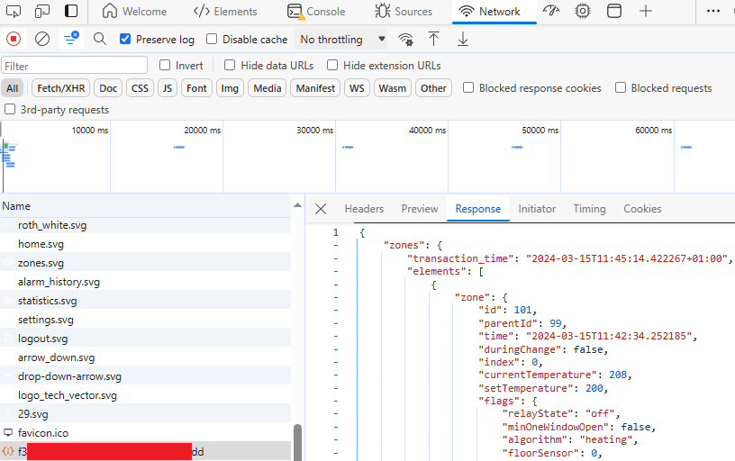

# Contributing to TECH Controllers integration for Home Assistant

:+1::tada: First off all, many thanks for taking the time to contribute! Appreciated! :tada::+1:

The following is a set of guidelines for contributing to this integration. These are mostly guidelines, not rules. Use your best judgment, and feel free to propose changes to this document in a pull request.

## Reporting Bugs

This section guides you through submitting a bug report for the integration. Following these guidelines helps maintainers and the community understand your report, reproduce the behavior, and find related reports.

Before creating bug reports, please check [this issues list](https://github.com/mariusz-ostoja-swierczynski/tech-controllers/issues) as you might find out that you don't need to create one. When you are creating a bug report, please **include as many details as possible**:

* **Use a clear and descriptive title** for the issue to identify the problem.
* **Describe the exact steps which reproduce the problem** in as many details as possible.
* **Provide specific examples to demonstrate the steps.**
* **Describe the behavior you observed after following the steps** and point out what exactly is the problem with that behavior.
* **Explain which behavior you expected to see instead and why.**
* **Provide both HA and integration software version numbers.**
* **Please try to include logs**

### Getting logs from your Home Assistant

1. Enable debug logs for "tech" component by going to `Devices & Services` -> Tech Controllers and clicking on `Enable debug logging`:

    

2. Try to trigger the issue to gather the logs.

3. Disable logging in the same place as in step 1. Download the created file and attach to the issue.

### Getting JSON data from emodul

Getting actual raw JSON data directly from emodul can be very helpful in debugging issues.

1. Go to your emodul site [emodul.pl](https://emodul.pl)/[emodul.eu](https://emodul.eu) while logged in, open Developer Tools (F12), Network tab.

2. Refresh the page and then look for XHR type request to your module id. Click on it and get the JSON response:

    

3. Save in a file and attach to the issue or if it's too big, save in a service like [Pastebin]( https://pastebin.com) and attach the link in the issue.

### Getting HA data

Sometimes it can also be helpful to get Home Assistant config entires, device registry and entity registry to check what was ultimately created for the integration.

1. Go to `<HA installation folder>/config/.storage`.

2. Downlaod all three files: `core.device_registry`, `core.entity_registry`, `core.config_entry`

3. Edit the files to contain only `tech` domain items.

4. :exclamation: Edit the files to remove all sensitive information like passwords :exclamation:

5. Pack the files into a .zip file and attach to the isse.

> [!CAUTION]
> :warning: Always remember to remove any sensitive and personal information from the logs! Especially remove/redact your `email`, `username`, `password`, `user_id` and `token`!.
